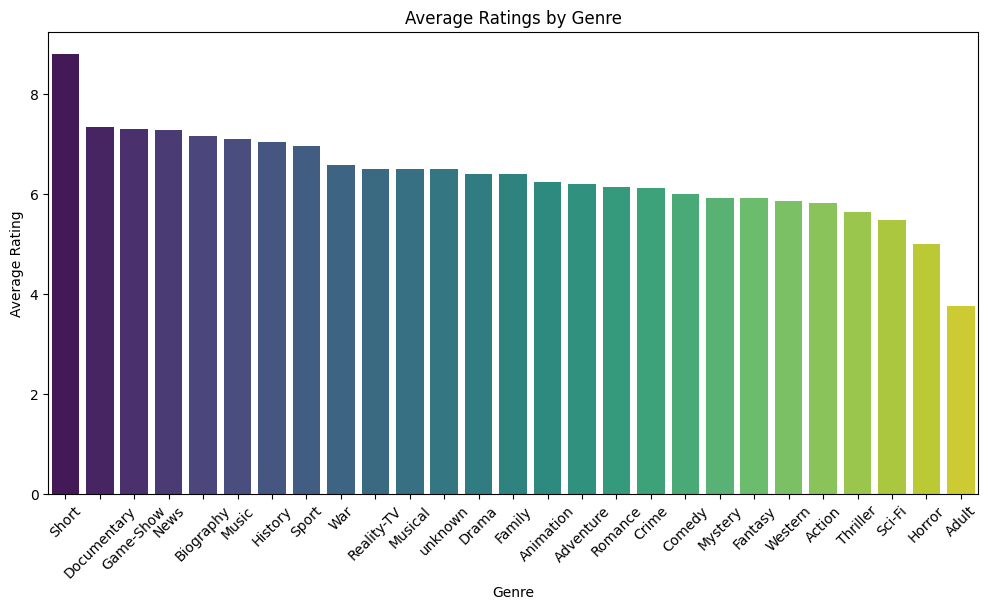
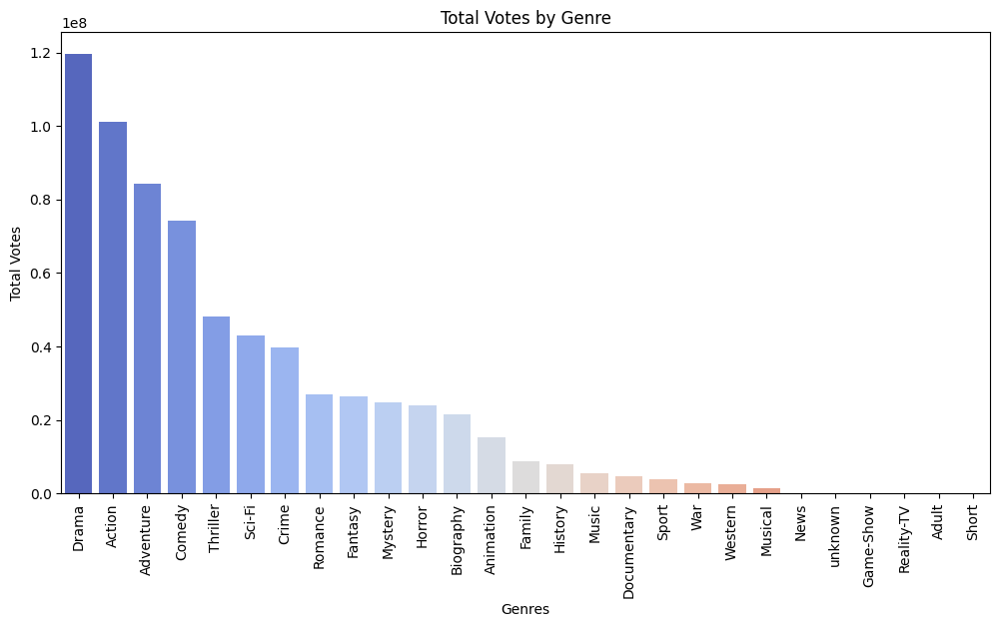
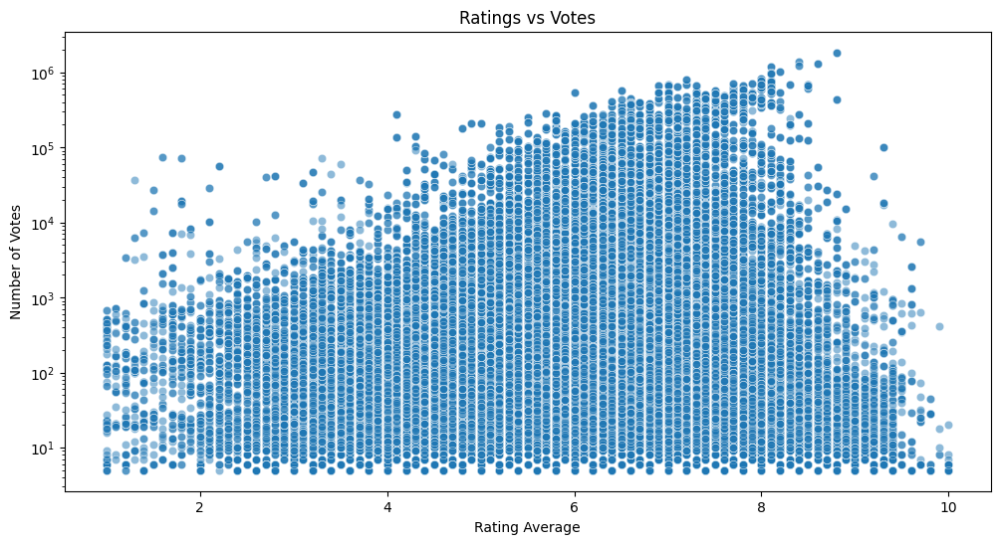
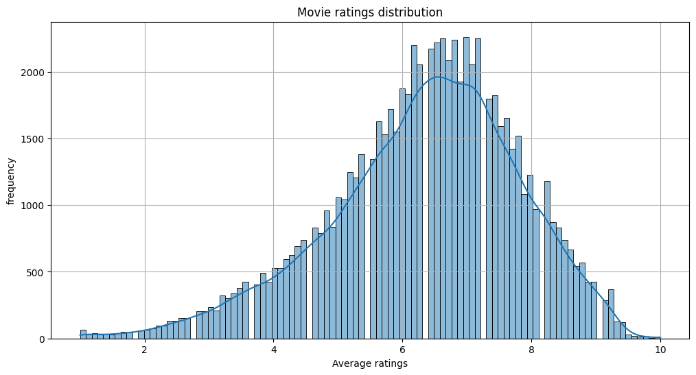
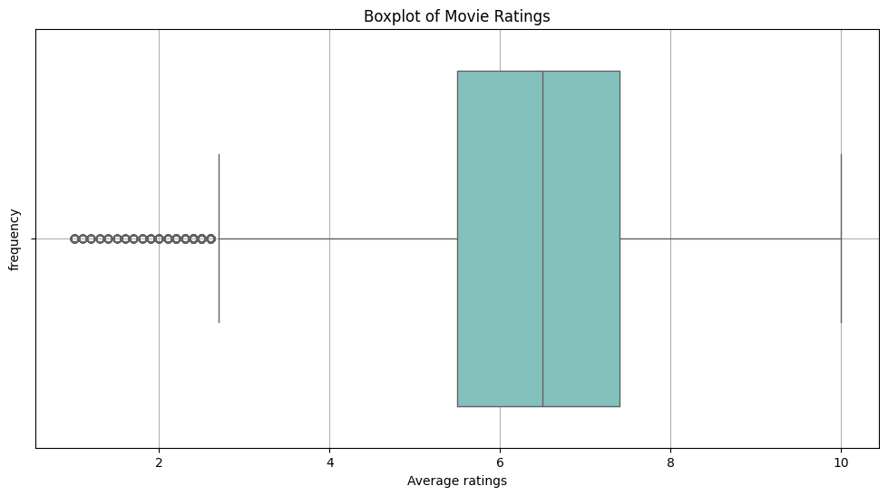
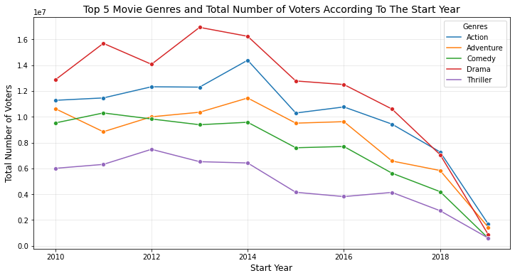

# Movie Industry Analysis

### Overview
This analysis examines historical movie data from IMDB to identify successful patterns in the film industry. The findings will guide the company's strategic decisions as they enter into movie business.

### Business Problem
Our company has noticed that major corporations are investing in original video content, and we want to join in on the trend. To do so, we’ve decided to launch our own movie studio. However, we have little to no experience in filmmaking.

Our task is to analyze which types of films are currently performing best at the box office. Based on our findings, we will translate the data into actionable insights that will help our studio head make informed decisions about the types of films we should produce.

### Objectives:
- Analyze movie ratings and subscription trends to identify top-performing films.
- Provide business recommendations on popular genres that attract large audiences.
- Assess user feedback for insights into audience preferences.
- Identify high-rated genres with strong potential for success.

### Data Source
Analysis based on [IMDB](https://www.imdb.com/)database. The data contains information about movies, including their ratings, genres, and runtime and other details.

### Data Understanding
The database contains 7 tables and our focus is on the Movie_basics and Movie_ratings in our analysis.

- Movie_basics: Contains information about movies, including their titles, genres, and release years.
- Movie_ratings: Contains information about the ratings of movies, including their average ratings and number of votes.

### Data Preparation and Cleanin
   #### Data Cleaning
     During the data cleaning process, the following steps were taken:
     - Dropped duplicate columns
     - Renamed columns to be more descriptive
     - Dropped rows with missing values
     - Filled genre missing values with "Unknown" 
     
### Data Visualization
1. **Genre Performance Analysis**
   - **Bar Plot: Average Ratings by Genre**
     - The bar plot shows the average ratings for each genre.
      
     - Horizontal bar chart showing average ratings for each genre
     - Color-coded bars indicating rating distribution
     - Error bars showing rating variance
     - Key insight: Drama and Documentary genres lead in average ratings
  
   - **Bar Plot of ratings by Genre**
      
      - Key insights: Drama, Action and Adventure lead by the number of votes

   - **Scatter Plot: Ratings vs. Vote Count**
     - Scatter plot showing the relationship between the number of votes and the average rating for each genre
      
     - X-axis: Average rating (log scale)
     - Y-axis: Number of votes
     - Points colored by genre
     - Reveals relationship between popularity and ratings

2. **Votes and ratings Distribution**
   - **Histogram: Movie ratings Distribution**
      
     - Shows frequency distribution of movie ratings
     - Vertical lines indicating median and mean
     - Key finding: Most movies cluster between 6.5 and 8.5

   - **Box Plot: Ratings**
  
      
     - The boxplot provides a visual representation of the distribution of movie ratings. The central line in the box represents the median rating, while the edges of the box represent the first (Q1) and third quartiles (Q3). The "whiskers" extend to show the range of the data, excluding outliers. Outliers are represented as individual points outside the whiskers. This plot helps identify the spread and skewness of movie ratings, as well as any potential outliers.
3. **Temporal Analysis**
   - **Line Plot: MGenre Votes Over Time**
     - Yearly trend of each genre vote over time
      

### Key Visualization Insights
- Drama consistently shows high ratings and vote counts
- Recent years show increased movie production across genres
- Audience engagement (votes) correlates with average ratings
- Genre popularity shows clear temporal patterns

### Visualization Tools Used
- Matplotlib for basic plots
- Seaborn for statistical visualizations
- Custom color palettes for clarity
- Interactive features for detailed exploration

### Key Findings

1. **Genre Performance**
   - Drama leads with highest average rating (6.40) and viewer engagement (119.5M votes)
   - Action films show strong viewer engagement (101.1M votes)
   - Documentaries have high ratings (7.30) but lower viewership
   - Adventure films maintain consistent performance (6.19 average rating)

### Conclusion and Business Recommendations

1. **Top Genres by Average Rating:**
   - Drama (6.40 average rating, highest total votes at ~119.5M)
   - Adventure (6.19 average rating)
   - Documentary (high average rating of ~7.30)
2. **Most Popular Genres by Total Votes:**
    - Drama (~119.5M votes)
    - Action (~101.1M votes)
    - Adventure (significant vote count)
3. **Key Insights:**
    - Drama consistently performs well in both ratings and viewer engagement
    - Action movies get high viewer engagement despite slightly lower average ratings
    - Documentary shows high ratings but lower total votes, indicating a niche but appreciative audience
4. **Recommendations for the New Studio:**
    - **Primary Focus:**
        - Consider Drama as a primary genre due to its consistent high performance in both ratings and viewer engagement
        - Action-Adventure combinations could be profitable due to high viewer engagement
    - **Strategic Opportunities:**
        - Look into hybrid genres (e.g., Drama-Action) to maximize appeal
        - Consider Documentary features as lower-budget, high-quality projects
    - **Risk Management:**
        - Start with Drama genre as it shows the most stable performance
        - Gradually expand into Action and Adventure genres as these may require higher budgets but show strong viewer engagement
        - Documentary genre could be a good option for a low-budget project that appeals to a smaller audience

### Tools Used
- Python
- SQLite for database queries
- Pandas for data analysis
- Matplotlib/Seaborn for visualization

### Next Steps
**Define Studio’s Niche & Business Model**
   - Decide on theatrical, streaming, or hybrid release strategy.
   - Focus on genres with high engagement (Drama, Action-Adventure, Documentaries).
  
**Develop a Production Roadmap**
   - Choosing a pilot project based on stable box office performance.
   - Plan budgeting & funding (investors, co-productions, grants).

**Assemble Talent & Team**
   - Hiring producers, directors, screenwriters, and crew.
   - Securing strong talent to enhance market appeal.
  
**Plan Marketing & Distribution**
   - Selecting a release strategy (film festivals, theatrical, streaming).
   - Creating a marketing plan (social media, PR, partnerships).
  
**Execute & Track Performance**
   - Beginning with small to mid-scale productions before expanding.
   - Analyzing audience reception & financial performance for future improvements.
